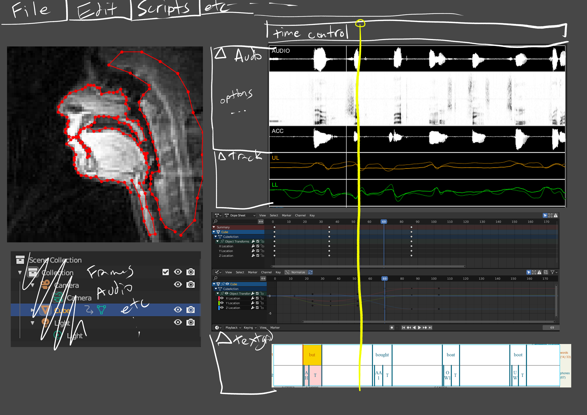
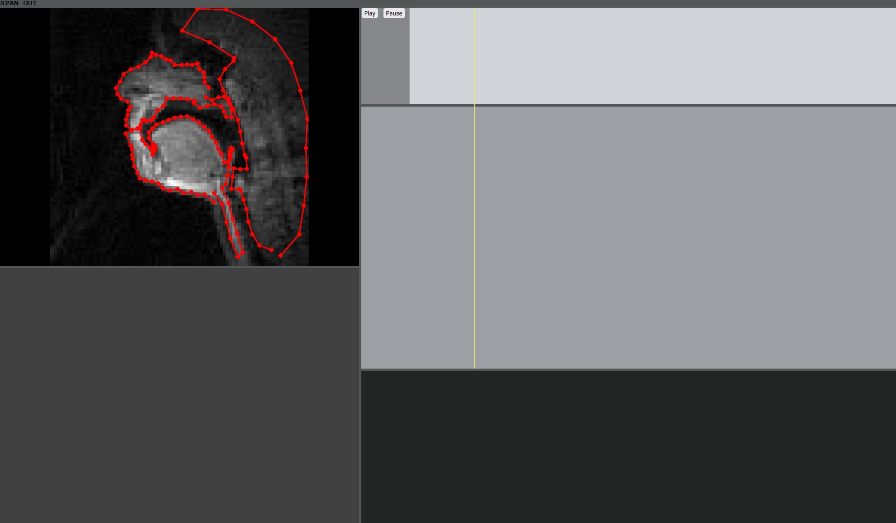

# SPAN MRI Analysis Tools

In progress GUI to analyze SPAN data. I'm basically envisioning something between mview and praat with added interractability and scriptability.

The priorities of this are as follows:
- Easy to modify/extend (at least the python stuff)
- Friendly interface
- Ability to use as a standalone library without the GUI
- Performant

What I want:
<p align="center"></p>

What's there rn:
<p align="center"></p>

## Installation

```
pip install spanpygui/requirements.txt
```

## Running

```
python spanpygui/main.py
```

## Features

- File loading:
    - video
    - segmentation (from 2009)
    - textgrids
- Multithreaded rendering
- Video Playback control

## TODO

- Audio
- Completing the rest of the GUI (including base widgets)
- Terminal
- External loading

## Design Decisions

### Why Python?

The tooling was going to have to be either python or Matlab based on the existing tools. One can probably call python scripts in Matlab to achieve a similar effect to what I have. My observations of my peers seem to show a preference towards python, so that's what I'm going with (I too am more familiar with programming in python).

### Why Client-Server?

I don't trust myself to program this well or correctly the first try. A client-server architecture decouples core data processing from the gui, keeping the code more modular, hence easier to modify in parts. Also I personally don't like GUI programming in python, and barring the setup costs coding interfaces with html+js will likely largely be easier.

### Why Streaming Video?

The alternative is keeping redundant data on the client and the server, then render the video client side. I just thought it'd be best to reduce the amount of state in the client as much as possible, despite the fact that it'd probably decrease performance and increase altency, but idk, who cares about that for this (yet).